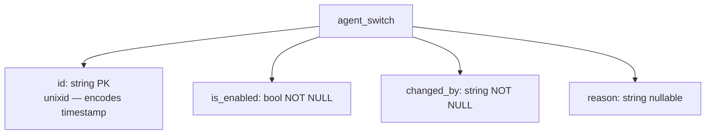

# agent-switch — Documentation Plan

> **Goal:** Create the complete standard documentation set so the module has a clear
> architecture reference, LLM-friendly skill summary, a database diagram, and a rich README
> that acts as an index.
>
> **No code changes.** This plan is documentation-only.

---

## Development Rules

- **Agent Setup:** Run `go install github.com/tinywasm/devflow/cmd/gotest@latest` before anything.
- **No external libraries.** Standard library + `tinywasm/*` polyfills only.
- **Build Tags:** All server-side files carry `//go:build !wasm`. Do not alter them.
- **Publishing:** Update documentation FIRST, then run `gopush 'docs: add architecture, skill and diagrams'`. Never `git commit/push` directly.
- **Diagram format:** Mermaid inside a `*.md` file stored in `docs/diagrams/`. Use `flowchart TD`. Never use `subgraph`.

---

## Context: What the module does

`agent-switch` is an **append-only audit log** that controls whether the AI agent is active
or inactive at runtime. Every enable/disable event is inserted as a new row — no deletes,
no updates. The latest row (highest `ID`) represents the current state.

**MCP Tools exposed (via `RegisterProvider`):**

| Tool | Description |
|------|-------------|
| `get_agent_status` | Returns the current `is_enabled` status, `changed_by`, timestamp, and optional reason. |
| `toggle_agent_status` | Inserts a new audit row. Parameters: `is_enabled` (bool), `changed_by` (string), `reason` (string, optional). |

**Schema (`agent_switch` table):**

| Field | Type | Constraint |
|-------|------|------------|
| `id` | string | PK (unixid) |
| `is_enabled` | bool | NOT NULL |
| `changed_by` | string | NOT NULL |
| `reason` | string | nullable |

---

## Step 1 — Create `docs/ARCHITECTURE.md`

Create the file `docs/ARCHITECTURE.md` with the following structure:

```markdown
# agent-switch Architecture

## 1. Domain Scope
Controls the AI agent's operational state at runtime through an append-only audit log.
Every state change is persisted as a new row; no data is ever mutated or deleted.

## 2. Core Entity
- **AgentSwitch:** A single audit event: who changed the state, when, why, and to what.
  The latest row (by `id` sort descending) is always the current state.

## 3. Architectural Patterns
1. **Append-Only Log:** INSERT only. No UPDATE, no DELETE. Revert by toggling again.
2. **Dependency Injection:** `New(db *orm.DB)` performs schema migration and returns `*Module`.
   No global state.
3. **MCP Self-Registration:** `*Module` implements `mcp.ToolProvider` via `GetMCPToolsMetadata()`.
   Registered onto an `*mcp.MCPServer` via `RegisterTools(srv)`.
4. **unixid Timestamps:** `ID` is generated by `unixid.NewUnixID()`. The embedded timestamp
   is parsed back on read to produce `changed_at`.

## 4. MCP Tools
| Tool | Parameters | Returns |
|------|-----------|---------|
| `get_agent_status` | — | `is_enabled`, `changed_by`, `changed_at`, `reason` |
| `toggle_agent_status` | `is_enabled` (bool, required), `changed_by` (string, required), `reason` (string, optional) | `ok`, `is_enabled` |

## 5. Schema
See [`docs/diagrams/database.md`](diagrams/database.md).
```

---

## Step 2 — Create `docs/diagrams/database.md`

Create the file `docs/diagrams/database.md`:

````markdown
# agent-switch — Database Diagram



> **Read strategy:** `SELECT ... ORDER BY id DESC LIMIT 1` — latest row = current state.
> INSERT only. No UPDATE. No DELETE.
````

---

## Step 3 — Create `docs/SKILL.md`

Create the file `docs/SKILL.md` with an LLM-friendly condensed summary:

```markdown
# agent-switch — LLM Skill Summary

## Purpose
Append-only audit log for AI agent enable/disable state.
Latest row = current state. Never mutate or delete rows.

## Key Files
| File | Role |
|------|------|
| `model.go` | `AgentSwitch` struct + `TableName()` |
| `model_orm.go` | Auto-generated ORM helpers — DO NOT EDIT |
| `mcp.go` | `Module`, `New(db)`, `GetMCPToolsMetadata()`, `RegisterTools()`, `GetStatus()`, `Toggle()` |
| `mcp_test.go` | All tests (in-package, `!wasm` build tag, `:memory:` SQLite) |

## Constraints
- INSERT only. No UPDATE, no DELETE.
- `New(db)` calls `db.CreateTable(&AgentSwitch{})` — module owns its migration.
- `changed_by` MUST be non-empty; injected by the application layer (e.g. from JWT).
- `ID` generated by `unixid`; timestamp extracted via `uid.Parse(id)`.

## MCP Registration
```go
m, _ := agentswitch.New(db)
m.RegisterTools(srv) // srv is *mcp.MCPServer
```
```

---

## Step 4 — Update `README.md`

Replace the current minimal `README.md` with an index that links all docs:

```markdown
# agent-switch
<!-- START_SECTION:BADGES_SECTION -->
<a href="docs/img/badges.svg"></a>
<!-- END_SECTION:BADGES_SECTION -->

Append-only runtime switch for AI agent enable/disable. Every state change is persisted
as a new row; the latest row represents the current state.

## MCP Tools

| Tool | Description |
|------|-------------|
| `get_agent_status` | Returns current enabled state, actor, timestamp, and reason. |
| `toggle_agent_status` | Inserts a new audit row (enable or disable). |

## Quick Start

```go
import agentswitch "github.com/veltylabs/agent-switch"

m, err := agentswitch.New(db)   // creates table + initialises module
m.RegisterTools(srv)            // registers MCP tools on *mcp.MCPServer
```

## Documentation

| Document | Description |
|----------|-------------|
| [ARCHITECTURE.md](docs/ARCHITECTURE.md) | Domain scope, patterns, and MCP tool reference |
| [Database Diagram](docs/diagrams/database.md) | Schema diagram |
| [SKILL.md](docs/SKILL.md) | LLM-friendly condensed summary |
```

---

## Step 5 — Verify & Submit

```bash
# No tests to run (documentation only), but verify the module still compiles:
gotest

# Publish
gopush 'docs: add architecture, database diagram, skill summary and enrich README'
```
