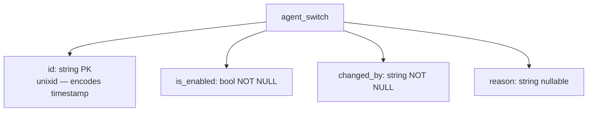

# agent-switch — Database Diagram

```mermaid
flowchart TD
    A[agent_switch]
    A --> B[id: string PK<br/>unixid — encodes timestamp]
    A --> C[is_enabled: bool NOT NULL]
    A --> D[changed_by: string NOT NULL]
    A --> E[reason: string nullable]
```

> **Read strategy:** `SELECT ... ORDER BY id DESC LIMIT 1` — latest row = current state.
> INSERT only. No UPDATE. No DELETE.
